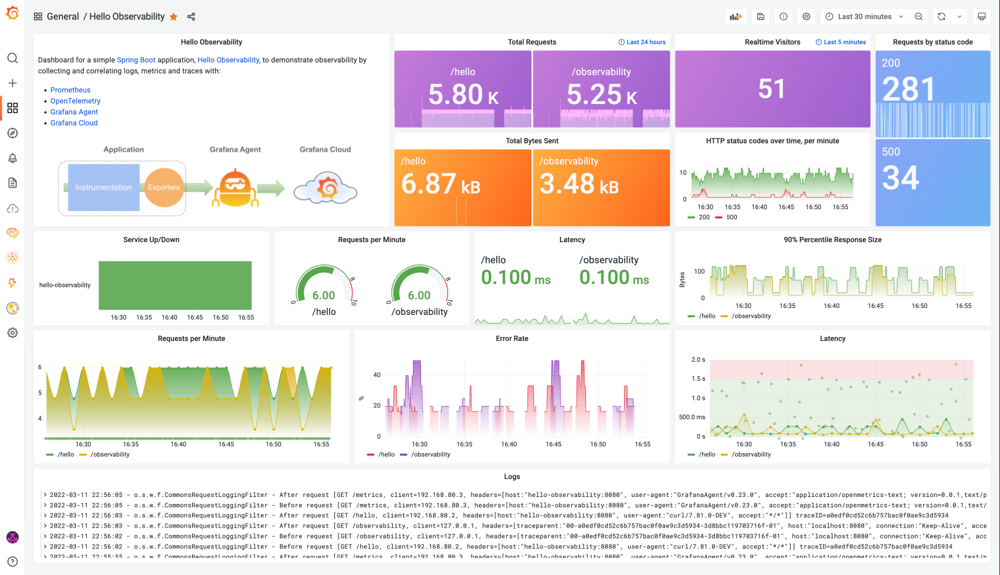
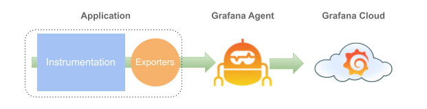

# Hello Observability
Simple [Spring Boot](https://spring.io/guides/gs/spring-boot) application to demonstrate collecting and correlating logs, metrics and traces with [Prometheus](https://prometheus.io/), [OpenTelemetry](https://opentelemetry.io/), and [Grafana Cloud](https://grafana.com/products/cloud/). It is built using [Maven](https://spring.io/guides/gs/maven/). 

Refer to this [documentation](https://docs.google.com/document/d/1uU9BbLH3OrBRLPAOQyQ5W2MeeTup5F2m2x1Qs4QGsnA/edit?usp=sharing) for details.

To just see the application in action, you can build a jar file and run it from the command line.

```
git clone https://github.com/adamquan/hello-observability.git
cd hello-observability/hello-observability
./mvnw package
java -jar target/*.jar
```

You can then access Hello Observability here: http://localhost:8080/hello. Very simple application!


Or you can run it using Docker:

```
cd hello-observability/hello-observability
docker build -t hello-observability .
docker run -d -p 8080:8080 --name hello-observability hello-observability
```
Similarly, you can access the application here: http://localhost:8080/hello

You can stop the docker container using:

```
docker stop hello-observability
```

**Note** that when you run the application either using the Jar file or directly with docker, nothing will be collected. You will need start all services using `docker-compose`, either all locally or connect to Grafana Cloud, to generate and collect logs, metrics and traces.

## Running everything locally

You can run the whole stack locally inside Docker, after building the application container. The whole stack contains:

- The Hello Observability application
- The simple load runner
- Prometheus for metrics
- Loki for logs
- Tempo for traces
- Grafana Agent to collect logs, metrics and traces
- Grafana

```
cd hello-observability/local
docker-compose up
```
After all the containers are up, you can access the appliction here: http://localhost:8080/hello, and Grafana here: http://localhost:3000


Import the dashboard from the `dashboard.json` file,


and see something beautiful!
 



## Sending logs, metrics and traces to Grafana Cloud

You can also run the application locally, but send logs, metrics and traces to **Grafana Cloud**. You do need to configure the `cloud/config/agent.yaml` file with your Grafana Cloud information. Local components that starts inside Docker include:

- The Hello Observability application
- The simple load runner
- Grafana Agent to collect logs, metrics and traces

The architecture looks like: 



```
cd hello-observability/cloud
docker-compose up
```

Similary as you have done locally, import the dashboard and enjoy!

Here is a live version of the [dashboard](https://se-demo.grafana.net/d/UjJzQ1L7k/hello-observability?orgId=1)

